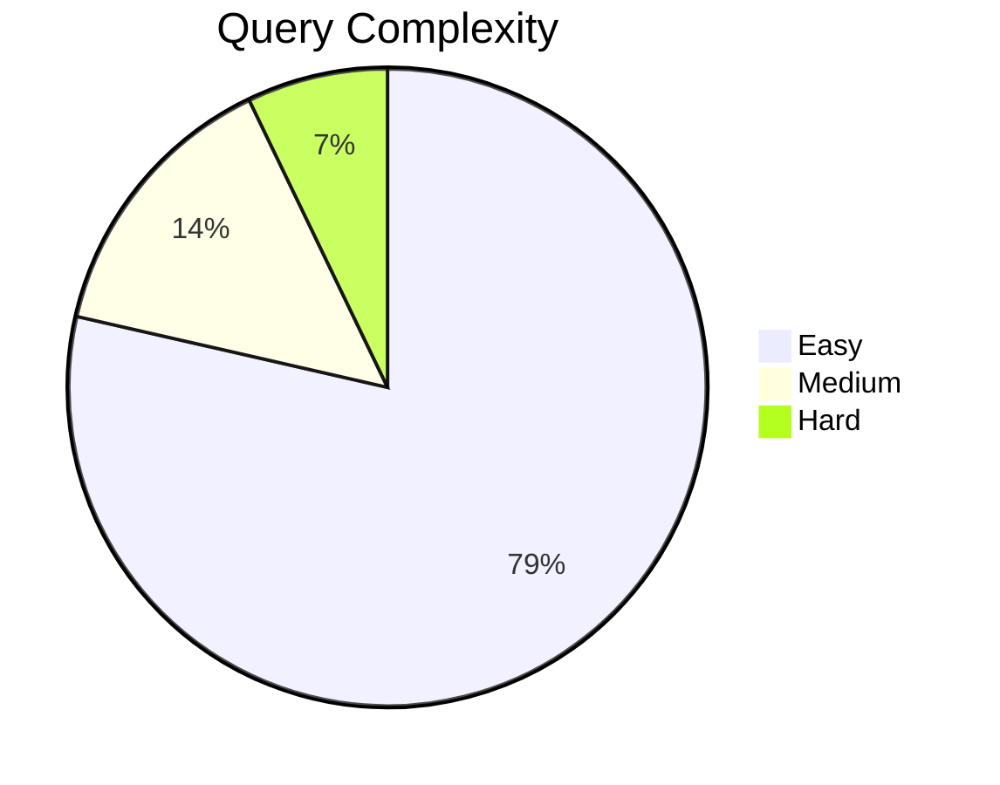

# Prisma Usage Map — Dana Finance OS

> Generated: 2026-05-10
> Scope: All files touching `@prisma/*`, `PrismaClient`, or `getDb()`
> Total: **13 files**, ~996 lines of Prisma-dependent code

---

## 1. Prisma Client Setup Files (4 files)

### 1.1 `src/lib/db.ts` (30 lines) — **Easy** ⚪
- **Purpose:** Local dev singleton PrismaClient with libSQL adapter
- **Prisma features:** `PrismaClient`, `PrismaLibSql` adapter
- **Pattern:** Global singleton (cached on `globalThis`)
- **Replacement:** Direct `createClient()` with `@libsql/client`
- **Notes:** Straight swap; only the adapter changes, query interface stays the same shape

### 1.2 `src/lib/db-cloudflare.ts` (24 lines) — **Easy** ⚪
- **Purpose:** Factory function for Cloudflare D1 PrismaClient
- **Prisma features:** `PrismaClient`, `PrismaD1` adapter
- **Pattern:** Per-request factory (no global cache)
- **Replacement:** Direct `D1Database` queries via `db.prepare()`
- **Notes:** Already isolated; can be replaced with a thin wrapper that returns a D1 binding

### 1.3 `src/lib/get-db.ts` (32 lines) — **Easy** ⚪
- **Purpose:** Unified `getDb()` factory that auto-detects environment
- **Prisma features:** `PrismaClient`, `PrismaD1`, `PrismaLibSql`
- **Pattern:** Conditional: D1 if arg passed, libSQL singleton otherwise
- **Replacement:** Replace with `getDb()` returning a D1 binding (CF) or libSQL client (local)
- **Notes:** This is THE central hub — swap this and all consumers change automatically

### 1.4 `src/lib/auth.ts` (59 lines) — **Medium** 🟡
- **Purpose:** Better Auth setup using Prisma adapter
- **Prisma features:** `PrismaClient`, `PrismaD1`, `PrismaLibSql`, `prismaAdapter()`
- **Pattern:** Creates PrismaClient inline, passes to `prismaAdapter(prisma, { provider: "sqlite" })`
- **Replacement:** Need to change adapter from `prismaAdapter` to Better Auth's D1 adapter (if exists) or implement raw database adapter
- **Specific challenge:** `better-auth` expects `prismaAdapter()` — will need `@better-auth/d1-adapter` or a custom adapter
- **Auth models used:** User, Session, Account, Verification (schema models)

---

## 2. API Route Handlers (9 files)

### 2.1 `src/app/api/dashboard/route.ts` (159 lines) — **Medium** 🟡
- **GET** — Aggregated dashboard data
- **Prisma operations:**
  ```typescript
  getDb().monthlyDashboard.findFirst({ where: { month: { gte, lt } } })       // 1 query
  getDb().grabEntry.findMany({ where: { date: { gte, lte } } })                // 1 query
  getDb().paymentCalendar.findMany({ where: { dueDate: { gte, lte } }, orderBy, include: { debt: { select } } })  // 1 query + join
  getDb().subscription.findMany({ where: { active: true } })                   // 1 query
  getDb().debt.findMany({ where: { status: "active" }, include: { payments: { where, orderBy } } })  // 1 query + nested include+where
  ```
- **Complexity:** 5 queries, 2 with joins (`include`); moderate date-range filtering
- **Error handling:** `Prisma.PrismaClientKnownRequestError` catch
- **Raw D1 replacement:** 5 separate SQL queries with JOINs or manual composition

### 2.2 `src/app/api/debt/route.ts` (75 lines) — **Easy** ⚪
- **GET** — List all debts with recent payments
  ```typescript
  getDb().debt.findMany({ orderBy, include: { payments: { orderBy, take: 5 } } })
  ```
- **POST** — Create debt
  ```typescript
  getDb().debt.create({ data: { ... } })
  ```
- **Complexity:** Simple CRUD, 1 join (include payments)
- **Error handling:** `Prisma.PrismaClientKnownRequestError`
- **Raw D1 replacement:** Straightforward SQL: `SELECT ... JOIN ...` / `INSERT INTO ...`

### 2.3 `src/app/api/debt/[id]/route.ts` (78 lines) — **Easy** ⚪
- **PATCH** — Update debt
  ```typescript
  getDb().debt.update({ where: { id }, data: { ... } })
  ```
- **DELETE** — Delete debt
  ```typescript
  getDb().debt.delete({ where: { id } })
  ```
- **Complexity:** Simple single-record operations
- **Error handling:** `Prisma.PrismaClientKnownRequestError`
- **Raw D1 replacement:** `UPDATE ... WHERE id = ?` / `DELETE FROM ... WHERE id = ?`

### 2.4 `src/app/api/debt/[id]/pay/route.ts` (79 lines) — **Hard** 🔴
- **POST** — Log a payment with atomic balance update
- **Prisma operations:**
  ```typescript
  getDb().debt.findUnique({ where: { id } })                                   // Check exists
  getDb().$transaction([                                                        // Atomic transaction
    getDb().paymentCalendar.create({ data: { ... } }),
    getDb().debt.update({ where: { id }, data: { balance, status } }),
  ])
  ```
- **Complexity:** Transaction with 2 operations — creates payment record AND updates debt balance atomically. Conditional `status` update to "paid" when balance reaches 0.
- **Error handling:** `Prisma.PrismaClientKnownRequestError`
- **Raw D1 replacement:** `D1Database.batch()` with 2 statements wrapped in a transaction. Must handle the conditional status logic in application code.
- **⚠️ Atomicity requirement:** Must ensure both operations succeed or fail together

### 2.5 `src/app/api/export/route.ts` (143 lines) — **Easy** ⚪
- **GET** — Export data as CSV (debts, payments, grab entries)
- **Prisma operations:**
  ```typescript
  getDb().debt.findMany({ orderBy, select: { ... } })                           // Export debts
  getDb().paymentCalendar.findMany({ orderBy, select: { ... }, include: { debt: { select } } })  // Export payments
  getDb().grabEntry.findMany({ orderBy, select: { ... } })                       // Export grab entries
  ```
- **Complexity:** 3 separate read-only queries with selection projection. No writes.
- **Error handling:** Generic `Error` catch (no Prisma-specific)
- **Raw D1 replacement:** Straightforward `SELECT col1, col2 FROM ...`

### 2.6 `src/app/api/grab/route.ts` (70 lines) — **Easy** ⚪
- **GET** — List last 50 grab entries
  ```typescript
  getDb().grabEntry.findMany({ orderBy: { date: "desc" }, take: 50 })
  ```
- **POST** — Create grab entry
  ```typescript
  getDb().grabEntry.create({ data: { ... } })
  ```
- **Complexity:** Simple CRUD, no joins
- **Error handling:** `Prisma.PrismaClientKnownRequestError`
- **Raw D1 replacement:** `SELECT ... ORDER BY date DESC LIMIT 50` / `INSERT INTO ...`

### 2.7 `src/app/api/payments/route.ts` (121 lines) — **Easy** ⚪
- **GET** — List payments with debt type
  ```typescript
  getDb().paymentCalendar.findMany({ orderBy, take: 50, include: { debt: { select: { type: true } } } })
  ```
- **POST** — Create payment
  ```typescript
  getDb().paymentCalendar.create({ data: { ... } })
  ```
- **PATCH** — Update payment status
  ```typescript
  getDb().paymentCalendar.findUnique({ where: { id } })           // Existence check
  getDb().paymentCalendar.update({ where: { id }, data: { ... } })
  ```
- **Complexity:** Simple CRUD, 1 join, no transactions
- **Error handling:** `Prisma.PrismaClientKnownRequestError`
- **Raw D1 replacement:** Standard SQL

### 2.8 `src/app/api/subscriptions/route.ts` (68 lines) — **Easy** ⚪
- **GET** — List subscriptions
  ```typescript
  getDb().subscription.findMany({ orderBy: { cost: "desc" } })
  ```
- **POST** — Create subscription
  ```typescript
  getDb().subscription.create({ data: { ... } })
  ```
- **Complexity:** Simple CRUD, no joins
- **Error handling:** `Prisma.PrismaClientKnownRequestError`
- **Raw D1 replacement:** `SELECT ... ORDER BY cost DESC` / `INSERT INTO ...`

### 2.9 `src/app/api/subscriptions/[id]/route.ts` (58 lines) — **Easy** ⚪
- **PATCH** — Update subscription
  ```typescript
  getDb().subscription.update({ where: { id }, data: { ... } })
  ```
- **Complexity:** Simple CRUD, no joins
- **Error handling:** `Prisma.PrismaClientKnownRequestError`
- **Raw D1 replacement:** `UPDATE ... WHERE id = ?`

---

## 3. Middleware

### 3.1 `src/middleware.ts` (53 lines) — **Not Prisma-using** ✂️
- **Purpose:** Session cookie check for page routes
- **Design note (lines 17-20):** Comment explicitly says they DON'T import Prisma here because Edge Runtime can't resolve `better-sqlite3`
- **Replacement:** No changes needed — already Prisma-free

---

## 4. Summary Table

| File | Lines | Queries | Complexity | Key Feature |
|------|-------|---------|------------|-------------|
| `src/lib/db.ts` | 30 | 0 (setup) | ⚪ Easy | Client singleton (libSQL) |
| `src/lib/db-cloudflare.ts` | 24 | 0 (setup) | ⚪ Easy | Client factory (D1) |
| `src/lib/get-db.ts` | 32 | 0 (setup) | ⚪ Easy | Uniied factory |
| `src/lib/auth.ts` | 59 | 0 (setup) | 🟡 Medium | Better Auth adapter |
| `dashboard/route.ts` | 159 | 5 | 🟡 Medium | Aggregations with joins |
| `debt/route.ts` | 75 | 2 | ⚪ Easy | CRUD + include |
| `debt/[id]/route.ts` | 78 | 2 | ⚪ Easy | Single-record CRUD |
| `debt/[id]/pay/route.ts` | 79 | 3 | 🔴 Hard | **Transaction** + conditional |
| `export/route.ts` | 143 | 3 | ⚪ Easy | Read-only projections |
| `grab/route.ts` | 70 | 2 | ⚪ Easy | CRUD |
| `payments/route.ts` | 121 | 4 | ⚪ Easy | CRUD + include |
| `subscriptions/route.ts` | 68 | 2 | ⚪ Easy | CRUD |
| `subscriptions/[id]/route.ts` | 58 | 1 | ⚪ Easy | Single-record update |
| **TOTAL** | **996** | **24** | — | — |

---

## 5. Prisma Features Used

| Feature | Files | Raw D1 Replacement |
|---------|-------|-------------------|
| `PrismaClient` constructor | 4 lib files | `new D1Client()` or direct `DB.prepare()` |
| `findMany()` | 9 API files + 1 lib | `SELECT ...` with optional `LIMIT`/`ORDER BY` |
| `findUnique()` | 2 files (`debt/[id]/pay`, `payments`) | `SELECT ... WHERE id = ?` |
| `findFirst()` | 1 file (`dashboard`) | `SELECT ... WHERE ... LIMIT 1` |
| `create()` | 6 files | `INSERT INTO ...` |
| `update()` | 4 files | `UPDATE ... WHERE id = ?` |
| `delete()` | 1 file (`debt/[id]`) | `DELETE FROM ... WHERE id = ?` |
| `$transaction()` | 1 file (`debt/[id]/pay`) | `D1Database.batch()` or raw transaction |
| `.include()` (joins) | 5 files | `JOIN` or 2 separate queries |
| `.where()` with date range | 2 files (`dashboard`, `export`) | `WHERE date BETWEEN ? AND ?` |
| `.orderBy()` | 9 files | `ORDER BY col ASC/DESC` |
| `.take()` | 3 files | `LIMIT n` |
| `select` projection | 1 file (`export`) | `SELECT col1, col2, ...` |
| `PrismaClientKnownRequestError` | 8 API files | Replace with try/catch on D1 errors |

---

## 6. Complexity Distribution



**Easy (11 files):** Simple CRUD, single-table, no transactions  
**Medium (2 files):** `dashboard/route.ts` (5 queries with joins), `auth.ts` (Better Auth adapter)  
**Hard (1 file):** `debt/[id]/pay/route.ts` (transaction with conditional logic)

---

## 7. Per-Model Query Count

| Model | # of queries | Files |
|-------|-------------|-------|
| `debt` | 6 | dashboard, debt/*, export |
| `paymentCalendar` | 5 | dashboard, debt/[id]/pay, export, payments |
| `grabEntry` | 3 | dashboard, export, grab |
| `subscription` | 3 | dashboard, subscriptions/* |
| `monthlyDashboard` | 1 | dashboard |
| `user` | 0 (auth) | auth.ts (managed by Better Auth) |
| `session` | 0 (auth) | auth.ts (managed by Better Auth) |

---

## 8. Key Concerns for D1 Migration

1. **Transaction in `debt/[id]/pay/route.ts`** — Must use `D1Database.batch()` or `D1.exec()` for atomicity
2. **Better Auth in `auth.ts`** — `prismaAdapter` is the trickiest replacement. Need a D1-native auth adapter or write one
3. **Global singleton pattern** — `db.ts` relies on `globalThis` caching; D1 doesn't need this (it's a binding)
4. **Error handling** — `Prisma.PrismaClientKnownRequestError` checks appear in 8 route files, need D1 error type equivalents
5. **25 raw `getDb().` calls** across all route handlers — mechanical replacement, but 25 touchpoints
